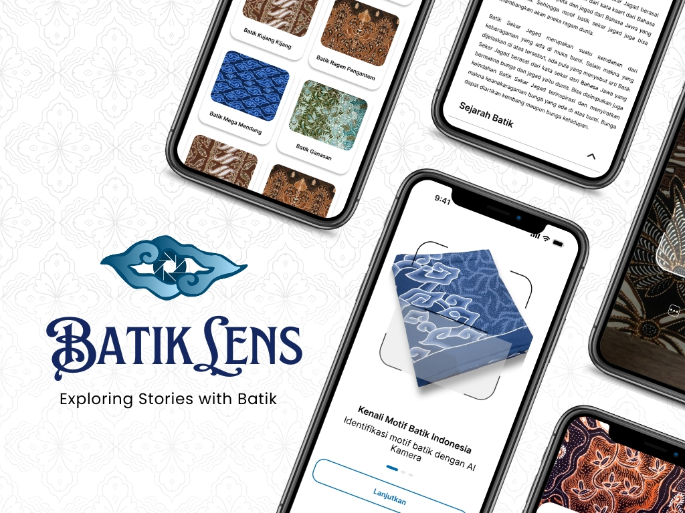

<!-- PROJECT LOGO -->
 

  

  <h3 align="center">BatikLens App</h3>
  
Exploring Stories with Batik

  

   This is a project to fulfill the  <a href="https://grow.google/intl/id_id/bangkit/"><strong>Bangkit Academy led by Google, Tokopedia, Gojek, & Traveloka »</strong></a>
   Program.
     
     
    <a href="https://drive.google.com/file/d/1MnJDAgkaCC7KscD_W4qzWYcea2s_9_il/view?usp=sharing">View Demo</a>
    ·
    <a href="https://drive.google.com/file/d/143P7asLrCoDRlHMwV9fWnCz6V-dXW7TI/view?usp=sharing">Slide Presentation</a>
  

<!-- TABLE OF CONTENTS -->

  
Table of Contents

  <ol>
    <li><a href="#background-the-Project">Background the Project</a></li>
    <li><a href="#getting-started">Getting Started</a></li>
    <li><a href="#our-team">Our Team</a></li>
  </ol>

<!-- ABOUT THE PROJECT -->

## Background the Project

Batik is one of Indonesia's cultural heritages that is rich in history and meaning. On October 2, 2009, batik was officially recognized as an Intangible Cultural Heritage by UNESCO. Based on 2021 data, there are 5,849 batik motifs recorded, spread from Aceh to Papua. The diversity of batik patterns makes motif identification a challenge, especially for the general public. The lack of easily understandable information also diminishes appreciation for the cultural value and uniqueness of batik.

Moreover, attribution errors, such as the recent controversy regarding the origins of batik, further emphasize the importance of having a platform capable of explaining and preserving batik as Indonesia's cultural heritage. To address this challenge, we developed an application called "BatikLens," an application for identifying batik motifs based on Convolutional Neural Network technology. (CNN). This application uses an image recognition system with a transfer learning algorithm to identify various batik motifs from images, whether taken directly or from a gallery. 

Through BatikLens, users can easily understand the name, regional origin, and meaning of each batik motif they encounter. This application not only serves as an educational tool but also as a means to introduce batik culture to the wider public. We hope this application can raise public awareness of the cultural value of batik, encourage greater appreciation, and support the preservation of Indonesia's cultural heritage. Thus, BatikLens supports a more inclusive world where everyone can understand and appreciate the richness of Indonesian culture without barriers.

### Built With

- [Android](https://www.android.com/)
- [Kotlin](https://kotlinlang.org/)
- [Tenserflow Lite](https://www.tensorflow.org/lite)
- [Express Js](https://expressjs.com/)
- [Firebase authentication](https://firebase.google.com/docs/auth)
- [Mysql](https://www.mysql.com/)
- [Compute Engine](https://cloud.google.com/compute)

### Repository

1. [BatikLens Mobile App](https://github.com/BatikLensApp/MD-BatikLensApp)
2. [BatikLens Backend](https://github.com/BatikLensApp/CC-BatikLensApp) 
3. [BatikLens ML](https://github.com/BatikLensApp/ML-BatikLensApp)

<!-- GETTING STARTED -->

## Getting Started

### Installation

1. Download Application  [Download](https://drive.google.com/drive/folders/1odF3C9LDv3druH4rMFAwMkVkN0P8m02p?usp=sharing)
2. Install on your Android devices.
3. Sign Up using Google Accoun or create new account.
4. Sing In and home will displayed the main content.
5. After sign in you must update profile in profile page.
6. Then you can detection batik pattern and explore other available features!✨🎨

<!-- OUR TEAM -->

## Our Team 

Team ID : C242-PS082

| Name | Bangkit ID | Role |Profile |
| ------ | ------ | ------ | ------ |
Ibra Sahrian Alsa | A546B4NY1894 | MD & PM | https://github.com/ibrarian9
Siti Nurhalizah | A156B4KX4176 | MD | https://github.com/halizahhhh 
Ravy Ardian Kusuma | M001B4KY3704 | ML | https://github.com/aapiiw
Nadya Mutia Safira | M156B4KX3212 | ML | https://github.com/NadyaMutia
Dhea Fadhila Salsabila | M001B4KX1093 | ML | https://github.com/dheafs
Try Helviansyah | C546B4NY4367 | CC | https://github.com/TryHelviansyah
Mutiara Novitasari | C381B4KX3166 | CC | https://www.linkedin.com/in/mutiara-novitasari-0ba060250/
